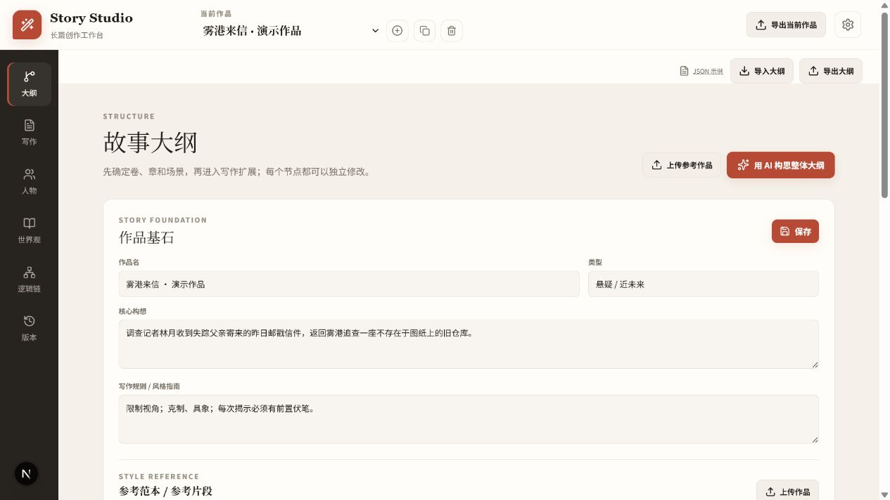
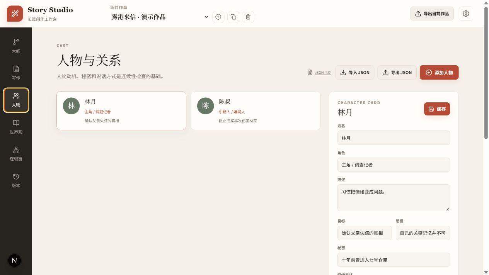
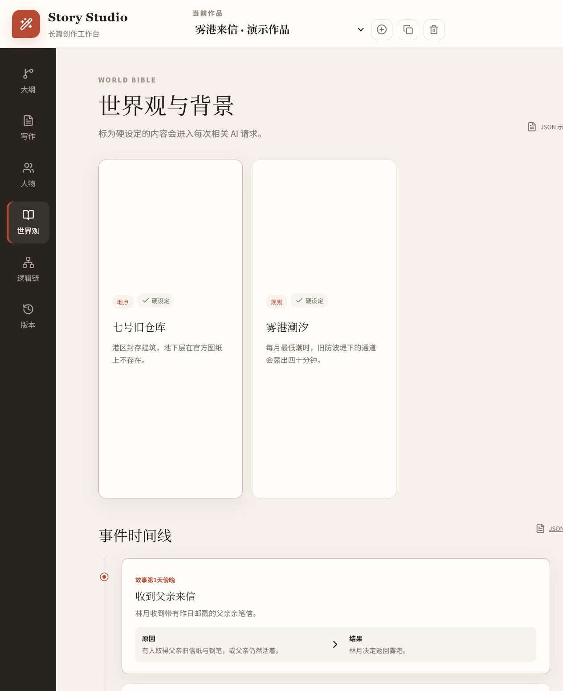
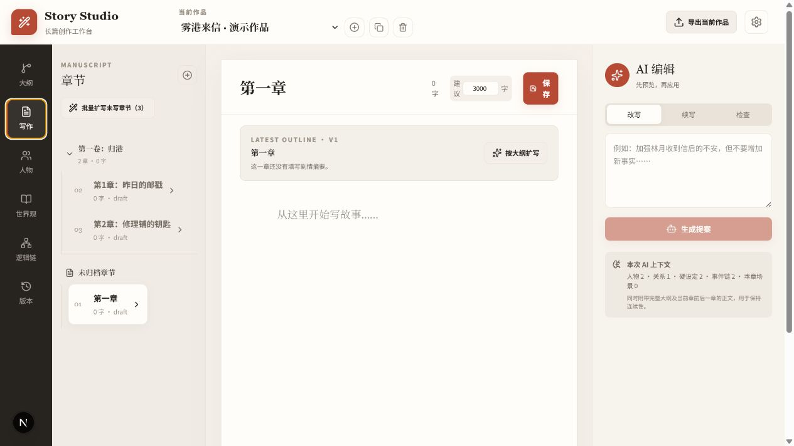
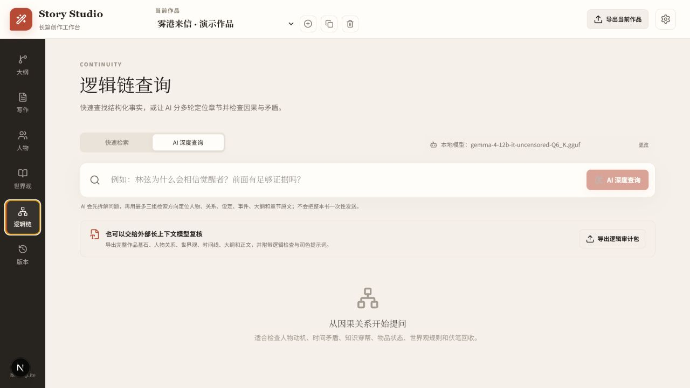
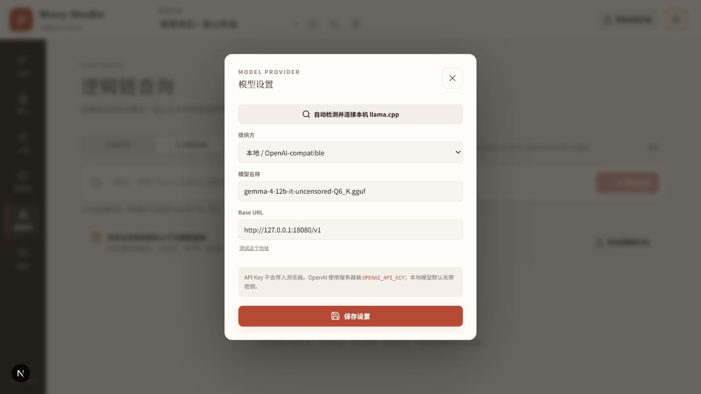

# Story Studio

一个本地优先、可切换大模型的开源长篇写作工作台。用结构化数据管理作品基石、大纲、章节、人物关系、世界观和事件因果链，再让 AI 在这些资料约束下协助创作、改写和检查连续性。

AI 在 Story Studio 中是可替换的编辑助手，而不是数据库：作品资料和正文保存在本地 SQLite；模型生成的内容可以预览、接受、修改并留下版本记录。



## 主要能力

- 同时管理多个作品，支持新建、切换、删除和“克隆为重写副本”
- 卷、章、场景三级树状大纲，支持手动增删改和 AI 生成
- 根据一卷介绍自动展开指定数量的章节和场景
- 大纲变化后自动标记关联正文为“待同步”
- 按大纲扩写单章，或按顺序批量扩写所有空白章节
- 管理人物性格、目标、恐惧、秘密、口吻和人物关系
- 管理世界观、背景和不可随意改变的硬设定
- 管理事件时间、前置原因和直接结果
- 本地快速检索与 AI 深度逻辑链检查
- OpenAI Responses API、本地 OpenAI-compatible 模型、外部手动模型三种方式
- 人物关系、世界观、时间线和大纲 JSON 导入导出
- Markdown 原稿、逻辑审计包、PDF/打印稿导出
- SQLite 本地持久化，插画文件保存在本机

## 快速开始

要求：Node.js 22 或更高版本。

```bash
git clone https://github.com/xiangyucao/story-studio.git
cd story-studio
npm install
cp .env.example .env.local
npm run dev
```

Windows PowerShell：

```powershell
git clone https://github.com/xiangyucao/story-studio.git
Set-Location story-studio
npm install
Copy-Item .env.example .env.local
npm run dev
```

默认打开 [http://localhost:3000](http://localhost:3000)。如果希望使用 4100 端口：

```bash
npm run dev -- -p 4100
```

不配置模型也可以使用作品管理、手动写作、JSON 导入导出和本地快速检索。

SQLite 默认保存在 `data/story-studio.db`，插画保存在同一数据目录。`data/` 已被 Git 忽略。可以通过 `STORY_STUDIO_DATA_DIR` 把数据迁移到其他磁盘。

## 从零开始写一本书

### 1. 新建作品并填写作品基石

点击顶部作品选择器旁边的 `+` 新建作品。在“大纲”页面填写：

- 作品名
- 类型
- 核心构想
- 写作规则 / 风格指南
- 可选的参考范本或参考片段

“参考范本”只用于学习叙事视角、句式、节奏、氛围和描写密度。提示词明确要求模型不要复制范本的人物、情节、专有名词和原句。长范本可以使用“精简范本”，让 AI 挑选具有代表性的原文片段并替换当前范本。

顶部的克隆按钮可以复制作品基石、大纲、卷章结构、人物、关系、世界观和时间线，但清空所有章节正文，适合使用同一套设定重新写一版。

### 2. 设计卷、章和场景大纲

大纲采用树状结构：

```text
作品
└─ 卷
   ├─ 章
   │  ├─ 场景
   │  └─ 场景
   └─ 章
```

可以从三种方式开始：

1. 手动添加卷、章和场景。
2. 点击“用 AI 构思整体大纲”，让 AI 根据类型、核心构想、规则和参考范本规划指定数量的卷。
3. 选中一卷，填写卷介绍，再点击“AI 展开为章节”，指定需要生成多少章。

每个节点都可以单独修改，也可以让 AI 只修改当前节点。AI 先返回提案，接受后才写入正式大纲。

大纲支持 JSON：

- 导出会保留节点 ID，适合交给外部 AI 修改后再导回。
- 导入会新增或更新节点，不会默认删除 JSON 中未出现的节点。
- 如果已写章节的大纲发生变化，可以选择清空正文；不清空则保留正文并标记“待同步”。

### 3. 建立人物和人物关系



人物资料包括：

- 姓名和角色定位
- 性格、经历和身份描述
- 当前目标
- 恐惧
- 秘密
- 说话风格

人物关系从已有角色中选择起点和终点，再填写关系类型与说明。方向有意义，例如“林月 → 陈叔：不完全信任”与反向关系可以表达不同态度。

人物与关系 JSON 使用全量替换：导入前会逐字段比较并标记“新增、修改、未变化、删除”；确认后删除旧人物和旧关系，只保留 JSON 中的数据。整个操作使用 SQLite 事务，导入失败不会破坏原数据。

### 4. 填写世界观、背景和硬设定



世界观条目可以是地点、组织、技术、历史、社会制度或超自然规则。每条设定可以选择：

- 硬设定：自动进入相关 AI 请求，模型不应随意违反。
- 草稿：保存在系统中，但暂不发送给 AI。

世界观 JSON 也采用全量替换，并使用 `isHardSetting` 表示是否为硬设定。导入预览会显示真正新增、修改、未变化和将删除的内容。

### 5. 建立时间线和因果链

每个时间线事件包含：

- 事件名称
- 故事内时间
- 事件经过
- 前置原因
- 直接结果

时间线不是单纯的日期列表。原因和结果会作为因果链发送给 AI，帮助模型避免人物无缘无故行动、道具突然出现或结果早于原因。

时间线 JSON 使用全量替换。可以先导出现有时间线，交给其他工具整理，再导回系统。

### 6. 按大纲写作



进入“写作”页面，从左侧卷章树选择章节。每章可以设置建议字数，默认约 3000 字。

点击“按大纲扩写”时，模型会获得：

- 作品类型、核心构想和写作规则
- 参考范本
- 当前卷完整大纲和其他卷摘要
- 当前章节的全部场景标题与描述
- 人物资料和人物关系
- 硬设定
- 事件时间线及因果链
- 当前章前后的相关正文，用于保持衔接
- 当前章节标题、大纲和建议字数

模型生成后先显示提案。接受后写入当前章节并记录版本。系统会校验目标章节，避免在第六章误写成第五章。

“批量扩写未写章节”会按顺序处理所有正文为空的章节，每章生成后自动接受并保存；已有正文不会被覆盖。可以随时要求在当前章保存完成后停止。

如果大纲后来改变：

- 章节会显示“正文基于旧大纲”。
- 可以点击“按新大纲重写”。
- 也可以手动修改正文，再标记为已经同步。

### 7. 修改和保存版本

正文可以直接在中央编辑器中修改并保存。AI 改写和保存操作会进入版本历史，便于查看修改前后长度和修改原因。

当前版本系统以追踪为主，不会自动覆盖未确认的 AI 提案。重要修改前仍建议导出 Markdown 或备份 SQLite 数据库。

### 8. 检查逻辑链和连续性



逻辑链页面提供两种模式：

- 快速检索：只在本地 SQLite 中搜索人物、关系、设定、事件、大纲和章节，不调用模型。
- AI 深度查询：先把问题拆成多组检索方向，在本地定位相关证据，再把有限的相关片段交给模型分析；不会一次把整本书发送出去。

适合检查：

- 人物动机是否有铺垫
- 时间顺序是否矛盾
- 人物是否提前知道不该知道的信息
- 道具状态是否连续
- 世界观规则是否被违反
- 伏笔是否回收

还可以导出“逻辑审计包”，交给 Gemini、Claude、ChatGPT 等长上下文模型进行全书检查和润色。

## 模型配置



### OpenAI Responses API

在 `.env.local` 中填写：

```dotenv
OPENAI_API_KEY=your_key
OPENAI_MODEL=gpt-5.4-mini
```

重启 Story Studio，在模型设置中选择 `OpenAI Responses API`，并填写账户可用的模型 ID。正文调用 Responses API；大纲等结构化内容使用严格 JSON Schema 解析。

API 计费与 ChatGPT Plus/Pro 订阅分开。密钥只由 Next.js 服务端读取，不会保存在浏览器或 SQLite。

### 本地模型 / llama.cpp / Ollama

任何实现 OpenAI Chat Completions 兼容接口的本地服务都可以接入：

```dotenv
LOCAL_MODEL_BASE_URL=http://127.0.0.1:11434/v1
LOCAL_MODEL=qwen3:8b
LOCAL_MODEL_API_KEY=local
```

在模型设置中选择“本地 / OpenAI-compatible”，填写 Base URL 和模型名称。也可以点击“自动检测并连接本机 llama.cpp”。

本地模型建议：

- 使用指令遵循和 JSON 输出能力较好的模型。
- 单章生成前系统会尝试清理 llama.cpp 旧 slot context。
- 不要盲目设置超大上下文；KV Cache 超出显存后借用共享 GPU 内存会明显变慢。
- 章节扩写通常只需要当前卷和相关资料，32K～64K 上下文往往已经足够。

### Gemini、Claude、NotebookLM 等外部模型

选择“外部模型（手动复制粘贴）”后，系统不会连接第三方网站，也不需要保存第三方 API Key。

使用流程：

1. 在 Story Studio 中选择目标章节或大纲节点。
2. 输入修改或写作要求。
3. 点击生成，系统会整理完整提示词并复制到剪贴板。
4. 把提示词粘贴到 Gemini、Claude、ChatGPT、NotebookLM 或其他模型。
5. 写作结果可以直接粘贴到章节编辑器并保存。
6. 结构化大纲结果按界面提示粘贴回来，预览后接受。

也可以通过 JSON 协作：先导出大纲、人物关系、世界观或时间线 JSON，让外部 AI 按原格式修改，再导入 Story Studio。导入预览会显示差异，避免盲目覆盖。

## JSON 数据规则

| 数据 | 导入方式 | 是否删除未出现的数据 |
| --- | --- | --- |
| 大纲 | 增量更新，优先按节点 ID 匹配 | 否 |
| 人物与关系 | 全量替换 | 是 |
| 世界观 | 全量替换 | 是 |
| 时间线 | 全量替换 | 是 |

每个页面都提供“JSON 示例”。建议先导出当前数据，在导出文件基础上修改，这样字段和结构最可靠。

## 插画与作品导出

在章节编辑器底部点击“添加图片”，可以加入 JPG、PNG 或 WebP 插画。图片保存在本地数据目录，不会自动上传到模型服务。

顶部“导出当前作品”提供：

- PDF / 打印稿：A4 排版，包含封面、卷、已有正文和插画。在系统打印窗口选择“另存为 PDF”。
- Markdown 原稿：适合备份、Git 版本管理和迁移到其他写作工具。

导出文件默认使用作品名。空白计划章节不会进入打印稿。

## Docker

```bash
docker build -t story-studio .
docker run --rm -p 3000:3000 -v story-studio-data:/app/data --env-file .env.local story-studio
```

## 数据与 AI 的边界

```text
SQLite（唯一真相来源）
  ├─ 作品基石 / 大纲 / 章节
  ├─ 人物 / 关系 / 世界观 / 时间线
  ├─ 本地逻辑检索
  └─ 上下文组装器
          ↓
   模型适配层
     ├─ OpenAI Responses API
     ├─ OpenAI-compatible Chat Completions
     └─ 外部模型手动交换
          ↓
      AI 提案 → 作者确认 → 版本记录 → 正式稿
```

## 开发与验证

```bash
npm run lint
npm run test
npm run build
```

主要目录：

```text
src/app/api/       本地 API
src/components/    管理界面
src/lib/db.ts      SQLite 模式与数据访问
src/lib/context.ts AI 上下文组装
src/lib/models.ts  模型适配层
docs/images/       README 界面截图
```

## 路线图

- 可视化人物关系图
- 大纲拖放排序
- 更精细的段落 diff 与逐项接受
- 事件知情状态和自动矛盾检测
- DOCX 导入导出
- Embedding 混合检索
- 可选的 Google Docs / NotebookLM Enterprise 同步适配器
- 插件式模型提供方

## 开源许可

[MIT](LICENSE)
